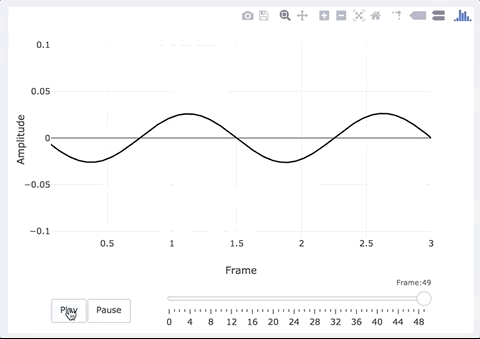

# Plotly viewer

다양한 Plot을 제공하는 Plotly 라이브러리를 활용한 뷰어 입니다. 이 라이브러리는 Python, R, Javascript등 다양한 언어로 제공되고 있습니다. plotly 라이브러리를 활용하여 생성한 Plot 데이터를 json 포멧으로 저장해야 해야합니다.

- [Plotly 활용 프로그래밍 ](../04_Science_App_Programing/02_Output_programing/04_Plotly.md)

 > EDISON에서는 plotly json 파일의 확장자를 ply로 지정하였습니다

메뉴 버튼을 클릭하면, 다음과 같은 기능을 수행할 수 있습니다.

|기능|설명|
|--|--|
|Open local|사용자 PC로부터 분자구조 파일을 불러올 수 있습니다.|
|Open Server| 출력포트 설정시 Extention과 Folder로 설정한 경우 다른 결과 파일을 불러올 수 있습니다.|
|Download |선택한 파일을 PC 저장할 수 있습니다.|

Plotly 활용 데이터 가시화 예시

