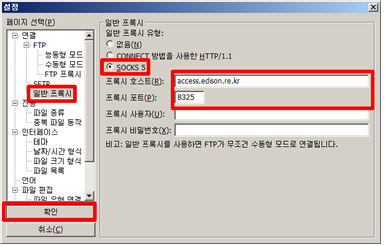

# 개발자 서버 접속

개발자 계정 발급 절차를 통해 EDISON SW를 등록할 수 있는 웹페이지 권한과 개발자 서버(bulb)에 접속할 수 있는 아이디와 최초 비밀번호를 발급 받게 됩니다.

### 개발자 서버 bulb 계정 확인

개발자 서버에 접속하기 위한 아이디와 비밀번호는 **EDISON 사이트 접속 > My EDISON > 워크스페이스** 에서 확인할 수 있습니다.


### 개발자 서버 접속

#### Putty로 Bulb 접속하기 (ssh)


[PuTTY 다운로드](http://www.chiark.greenend.org.uk/~sgtatham/putty/download.html) 후 아래 그림과 같이 접속

- 호스트 : bulb.edison.re.kr, 포트 : 22002, 프로토콜 : SSH
- 프록시 : SOCK 5, 프록시 호스트 : access.edison.re.kr, 프록시 포트 8325


최초 접속 시 비밀번호를 꼭 변경해 주세요.

- [리눅스에서 비밀번호 변경하기](https://www.linux.co.kr/home/lecture/index.php?cateNo=&secNo=&theNo=&leccode=247)


#### FileZilla Bulb 접속하기 (sftp)

[File Zilla 다운로드](https://filezilla-project.org/) 후 아래 그림과 같이 접속
- 호스트 : bulb.edison.re.kr, 포트 : 22002, 프로토콜 : SFTP
- FileZilla > 편집 > 설정 이동
 - 프록시 : SOCK 5, 프록시 호스트 : access.edison.re.kr, 프록시 포트 8325





#### Mac OS Terminal로 bulb 접속하기  (ssh)

터미널 접속 후 아래 커멘드 입력

```
ssh -o ProxyCommand='nc -x access.edison.re.kr:8325 %h %p' [User_id]@bulb.edison.re.kr -p 22002
```
**[User_id]** 부분의 본인의 아이디를 입력하고 커멘드 실행

#### Linux Terminal로 bulb 접속하기  (ssh)

##### Cent OS 7
```connect-proxy``` 설치 후 아래 커멘드 입력
```
ssh -o ProxyCommand="connect-proxy -S access.edison.re.kr:8325 %h %p" [User_id]@bulb.edison.re.kr -p 22002
```
